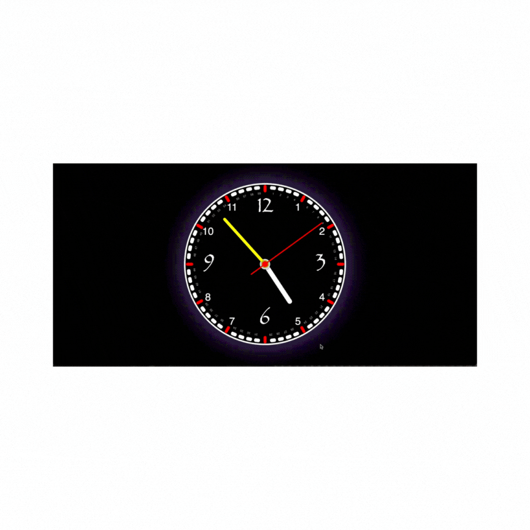

## ⏰ Analog Clock

✅This project is a real-time analog clock built using HTML, CSS, and JavaScript. 🕒

✅The hour, minute, and second hands move in real-time, providing the user with the current time in a visually appealing way. 🌟

## ✨ Features

🕰 Real-time movement – Live clock updates with JavaScript

🎨 Modern design with CSS – Dark theme and glowing edge effect

📱 Responsive design – Optimized for all devices

## 🛠 Technologies Used

🖼 HTML5 – Structural layout

🎨 CSS3 – Visual styling and animations

⚡ JavaScript (ES6) – Dynamic time calculation and movement

